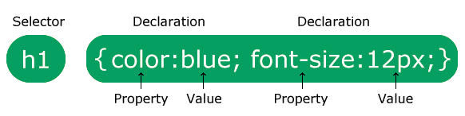
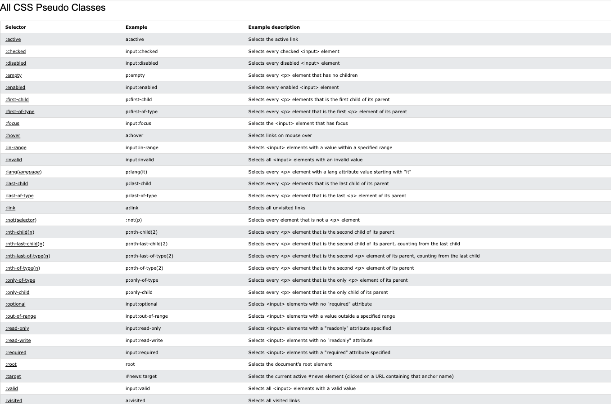
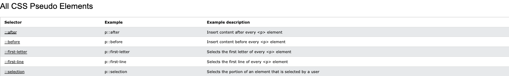

<div align = "center">
  
</div>

<hr>

## Table of Contents

- [What is CSS?](#what-is-css)
- [Why Use CSS?](#why-use-css)
- [CSS Solved a Big Problem](#css-solved-a-big-problem)
- [CSS Syntax](#css-syntax)
- [CSS Selector](#css-selector)
  - [Simple Selectors](#simple-selectors)
  - [Combinator Selectors](#combinator-selectors)
  - [CSS Pseudo-classes](#pseudo-classes)
  - [CSS Pseudo-elements](#pseudo-elements)

# What is CSS?

CSS (Cascading Style Sheets) is the language we use to style an HTML document, and it describes how HTML elements should be displayed.

# Why use CSS?

CSS is used to define styles for your web pages, including the design, layout and variations in display for different devices and screen sizes.

# CSS Solved a Big Problem

HTML was NEVER intended to contain tags for formatting a web page!

HTML was created to describe the content of a web page, like:

```css
<h1>This is a heading</h1>
<p>This is a paragraph.</p>
```

When tags like `<font>`, and color attributes were added to the HTML 3.2 specification, it started a nightmare for web developers. Development of large websites, where fonts and color information were added to every single page, became a long and expensive process.

To solve this problem, the World Wide Web Consortium (W3C) created CSS.

CSS removed the style formatting from the HTML page.

The style definitions are normally saved in external `.css` files.

With an external stylesheet file, you can change the look of an entire website by changing just one file!

# CSS Syntax

A CSS rule consists of a selector and a declaration block.

<div align="center">
  
</div>

The selector points to the HTML element you want to style.

The declaration block contains one or more declarations separated by semicolons.

Each declaration includes a CSS property name and a value, separated by a colon.

Multiple CSS declarations are separated with semicolons, and declaration blocks are surrounded by curly braces.

In this example all `<p>` elements will be center-aligned, with a red text color:
```css
  p {
    color: red;
    text-align: center;
  }
```

Example Explained

  - `p` is a selector in CSS (it points to the HTML element you want to style: `<p>`)
  - `color` is a property, and `red` is the property value
  - `text-align` is a property, and `center` is the property value

# CSS Selector

CSS selectors are used to "find" (or select) the HTML elements you want to style.

We can divide CSS selectors into five categories:

## Simple Selectors

Select elements based on name, id, class

In this example all `<div>` elements will be set with a background color red:

```css
  div {
    background: red;
  }
```

The <u>**ID Selector**</u> uses the id attribute of an HTML element to select a specific element.

The id of an element is unique within a page, so the id selector is used to select one unique element.

To select an element with a specific id, write a hash `(#)` character, followed by the id of the element.

The CSS rule below will be applied to the HTML element with `id="para1"`:

```css
  #para1 {
    text-align: center;
    color: red;
  }
```

The <u>**_Class Selector_**</u> selects HTML elements with a specific class attribute.

To select elements with a specific class, write a period `(.)` character, followed by the class name.

In this example all HTML elements with class="center" will be red and center-aligned: 

```css
  .center {
    text-align: center;
    color: red;
  }
```

You can also specify that only specific HTML elements should be affected by a class.

In this example only <p> elements with class="center" will be red and center-aligned:

```css
  p.center {
    text-align: center;
    color: red;
  }
```

HTML elements can also refer to more than one class.

In this example the <p> element will be styled according to class="center" and to class="large": 

```css
  <p class="center large">This paragraph refers to two classes.</p> 
```

The <u>**_Universal Selector (*)_**</u> selects all HTML elements on the page.

The CSS rule below will affect every HTML element on the page: 

```css
  * {
    text-align: center;
    color: blue;
  }
```

The <u>**_Grouping Selector_**</u> selects all the HTML elements with the same style definitions.

Look at the following CSS code (the h1, h2, and p elements have the same style definitions):

```css
  h1 {
    text-align: center;
    color: red;
  }

  h2 {
    text-align: center;
    color: red;
  }

  p {
    text-align: center;
    color: red;
  }
```

It will be better to group the selectors, to minimize the code.

To group selectors, separate each selector with a comma.

In this example we have grouped the selectors from the code above: 

```css
  h1, h2, p {
    text-align: center;
    color: red;
  }
```

## Combinator Selectors

Select elements based on a specific relationship between them.

A CSS selector can contain more than one simple selector. Between the simple selectors, we can include a combinator.

There are four different combinators in CSS:

1. Desdcendant selector (space)
2. Child selector (>)
3. Adjacent sibling selector (+)
4. General sibling selector (~)

### <u>Descendant Selector</u>

The descendant selector matches all elements that are descendants of a specified element.

The following example selects all `<p>` elements inside `<div>` elements:

```css
  div p {
    background-color: yellow;
  }
```

### <u>Child Selector (>)</u>

The child selector selects all elements that are the children of a specified element.

The following example selects all `<p>` elements that are children of a `<div>` element:

```css
  div > p {
    background-color: yellow;
  }
```

### <u>Adjacent Sibling Selector (+)</u>

The adjacent sibling selector is used to select an element that is directly after another specific element.

Sibling elements must have the same parent element, and _"adjacent"_ means _"immediately following"_.

The following example selects the first `<p>` element that are placed immediately after `<div>` elements:

```css
  div + p {
    background-color: yellow;
  }
```

### <u>General Sibling Selector (~)</u>

The general sibling selector selects all elements that are next siblings of a specified element.

The following example selects all `<p>` elements that are next siblings of `<div>` elements: 

```css
  div ~ p {
    background-color: yellow;
  }
```

## Pseudo-classes

A pseudo-class is used to define a special state of an element.

For example, it can be used to:

1. Style an element when a user mouses over it
2. Style visited and unvisited links differently
3. Style an element when it gets focus

The syntax of pseudo-classes:

```css
  selector:pseudo-class {
    property: value;
  }
```

Links can be displayed in different ways:

```css
   /* unvisited link */
    a:link {
      color: #FF0000;
    }

    /* visited link */
    a:visited {
      color: #00FF00;
    }

    /* mouse over link */
    a:hover {
      color: #FF00FF;
    }

    /* selected link */
    a:active {
      color: #0000FF;
    } 
```

_Note: `a:hover` MUST come after `a:link` and a:visited in the CSS definition in order to be effective! `a:active` MUST come after `a:hover` in the CSS definition in order to be effective! Pseudo-class names are not case-sensitive._

Pseudo-classes can be combined with HTML classes:

When you hover over the link in the example, it will change color:

```css
  a.highlight:hover {
    color: #ff0000;
  }
```

An example of using the `:hover` pseudo-class on a `<div>` element:

```css
  div:hover {
    background-color: blue;
  }
```

Hover over a `<div>` element to show a `<p>` element (like a tooltip):

```css
  p {
    display: none;
    background-color: yellow;
    padding: 20px;
  }

  div:hover p {
    display: block;
  }
```

The `:first-child` pseudo-class matches a specified element that is the first child of another element.

In the following example, the selector matches any <p> element that is the first child of any element:

```css
  p:first-child {
    color: blue;
  }
```

In the following example, the selector matches the first `<i>` element in all `<p>` elements:

```css
  p i:first-child {
    color: blue;
  }
```

In the following example, the selector matches all `<i>` elements in `<p>` elements that are the first child of another element:

```css
  p:first-child i {
    color: blue;
  }
```

<div align="center">
  
</div>

## Pseudo-elements

A CSS pseudo-element is used to style specified parts of an element.

For example, it can be used to:

1. Style the first letter, or line, of an element
2. Insert content before, or after, the content of an element 

The syntax of pseudo-elements:

```css
  selector::pseudo-element {
    property: value;
  }
```

The `::first-line` pseudo-element is used to add a special style to the first line of a text.

The following example formats the first line of the text in all `<p>` elements:

```css
  p::first-line {
    color: #ff0000;
    font-variant: small-caps;
  }
```

_Note: The `::first-line` pseudo-element can only be applied to block-level elements._

The following properties apply to the ::first-line pseudo-element:

- font spacing
- color properties
- background properties
- word-spacing
- letter-spacing
- text-decoration
- vertical-align
- text-transform
- line-height
- clear

```txt
Notice the double colon notation - ::first-line versus :first-line

The double colon replaced the single-colon notation for pseudo-elements in CSS3. This was an attempt from W3C to distinguish between pseudo-classes and pseudo-elements.

The single-colon syntax was used for both pseudo-classes and pseudo-elements in CSS2 and CSS1.

For backward compatibility, the single-colon syntax is acceptable for CSS2 and CSS1 pseudo-elements.
```

<div align="center">
  
</div>